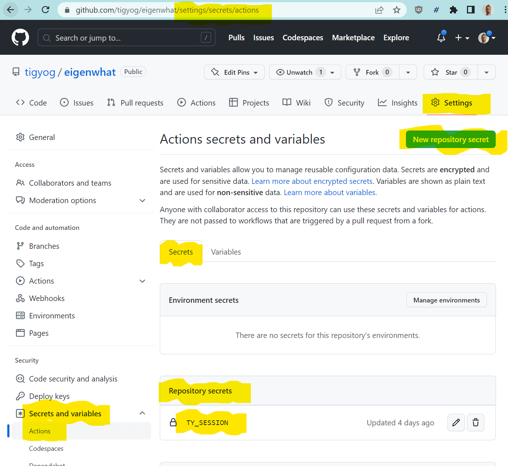

# TigYog.app CLI (BETA!)

For context, see [TigYog.app](https://tigyog.app/) and [the TigYog docs](https://docs.tigyog.app/).
For an example course being written with the TigYog CLI, see [_Eigenwhat?_](https://github.com/tigyog/eigenwhat).

## Installation and usage

```shell-session
$ npm install -g tigyog-cli  # Requires Node.js 16.11+
$ tigyog login my_session_token  # Get this from https://tigyog.app/account
$ mkdir my_course; cd my_course  # Create new directory for your course
$ tigyog init  # Initialize with starter course content
$ tigyog fmt  # Format your course, e.g. add identifiers
$ tigyog publish  # Push your course to TigYog.app and publish it
```

## Publishing from git

You might want to publish your course every time you push to a git repository.
If you're using GitHub, you can use [GitHub Actions](https://docs.github.com/en/actions/quickstart) for this.

On your GitHub repository, go to [Settings > Secrets and variables > Actions](https://docs.github.com/en/actions/security-guides/encrypted-secrets), and click "New repository secret".
Name the secret `TY_SESSION` and copy the value from [your TigYog account page](https://tigyog.app/account).
Once configured, it should look like this:



Then add [a workflow file like this](https://github.com/tigyog/eigenwhat/blob/main/.github/workflows/publish.yml) to your repository.
When you next push to your `main` branch, it should automatically publish the latest version to TigYog.

## Configuration

This tool uses [conf](https://github.com/sindresorhus/conf) to store its config, including your session token.
You can find this config at:

* MacOS: `~/Library/Preferences/tigyog-nodejs/config.json`
* Windows: `C:\Users\USERNAME\AppData\Roaming\tigyog-nodejs\Config\config.json`

## Planned features

If you need any of these, or have any other problems,
[email Jim](mailto:jameshfisher@gmail.com) or file a GitHub issue.

* All TigYog block types.
  Still to do:

  * Images: dark mode strategy
  * Responses not immediately following buttons
  * Callout

* API keys.
  Currently authenticates using session tokens taken from the browser.
  These expire after around 6 months.
